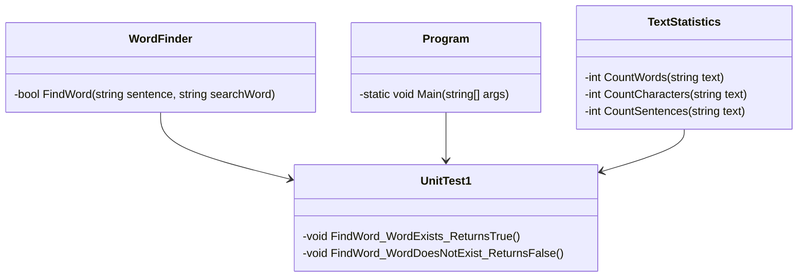

Ефимов Евгений ИСП - 307

```mermaid
classDiagram

    class UnitTest1 {
        -void FindWord_WordExists_ReturnsTrue()
        -void FindWord_WordDoesNotExist_ReturnsFalse()
    }

    class Program {
        -static void Main(string[] args)
    }

    class WordFinder {
        -bool FindWord(string sentence, string searchWord)
    }

    class TextStatistics {
        -int CountWords(string text)
        -int CountCharacters(string text)
        -int CountSentences(string text)
    }

    WordFinder --> UnitTest1
    Program --> UnitTest1
    TextStatistics --> UnitTest1
```
